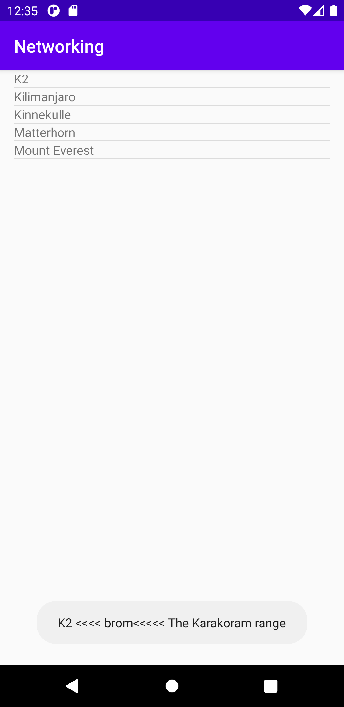

# Rapport

Assets mapp skapades och en ny fil lades in (mountains.json), där i lades sedan koden för alla berg in. Detta gjordes för att få den datan att visas som en sträng. Koden säger att
den ska hämta datan som finns i Assets och eftersom filen bara ska läsas en gång så lades den andra kodsnutten in i onCreate och där i står namnet på filen som eftersöks.

```
@SuppressWarnings("SameParameterValue")
private String readFile(String fileName) {
    try {
        //noinspection CharsetObjectCanBeUsed
        return new Scanner(getApplicationContext().getAssets().open(fileName), Charset.forName("UTF-8").name()).useDelimiter("\\A").next();
    } catch (IOException e) {
        Log.e(TAG, "Could not read file: " + fileName);
        return null;
    }
}
```

```
protected void onCreate(Bundle savedInstanceState) {
String s = readFile("mountains.json");
Log.d("MainActivity","The following text was found in textfile:\n\n"+s);
```

Jag skapade en klass som döptes till Mountain. I den klassen lades bland annat koden in som visas här nedanför. Denna kod säger att den ska innehålla informationen som finns i mountains.json.
Med hjälp av denna kod har förutsättningarna givits för att kunna låta gson biblioteket skapa bergen.

```
public class Mountain {
    private String ID;
    private String name;
    private String type;
```

Toast View valdes, dvs att namnet på bergen skulle visas i appen samt två andra egenskaper vilket var namn, typ och plats. När man klickar på till exempel K2 så blir resultatet det
som bild1 visar. Koden som visas som ligger i klassen Mountain behöver existera eftersom att det senare ska vara möjligt för värdena ska visas i appen.
Toast som finns i MainActivity lades i en setOnItemClickListener tillsammans med den andra kodsnutten som visas här nedanför för att Toast skulle veta vad för information som skulle visas.

```
public Mountain(String name,String type,String location){
        this.name = name;
        this.type = type;
        this.location= location;
    }
```

```
myListView.setOnItemClickListener(new AdapterView.OnItemClickListener() {
            @Override

            public void onItemClick(AdapterView<?> parent, View view, int position, long id) {
                String name = arrayMountain.get(position).getName();
                String type = arrayMountain.get(position).getType();
                String location = arrayMountain.get(position).getLocation();
                String sentence = name + " <<<< " + type + "<<<<< " +location ;
```




